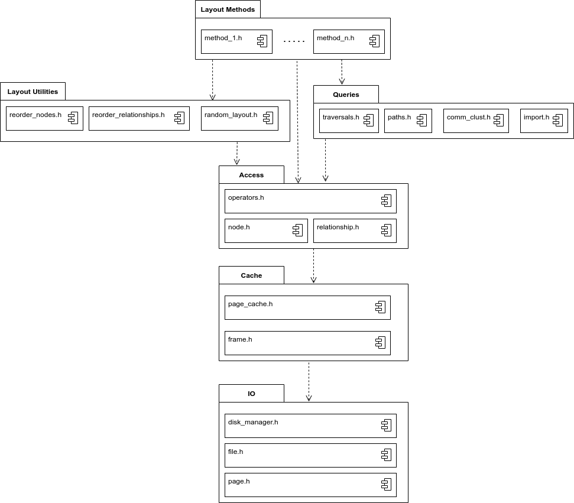

# Graph Order Evaluation Database
[](https://www.codacy.com/gh/SomeUserName1/master/dashboard?utm_source=github.com&amp;utm_medium=referral&amp;utm_content=SomeUserName1/master&amp;utm_campaign=Badge_Grade)  [](https://lgtm.com/projects/g/SomeUserName1/master/context:cpp) [](https://codecov.io/gh/SomeUserName1/master) 

The software in this repository provides an evaluation environment to experiment with the order of the graph as it is stored on disk.  
It consists of the low level components of a database with extended logging with respect to IO, several traversal-based queries, an importer for certain SNAP datasets and  utilities to change the order of the graph on disk.

## Architecture \& Source Code Organization


## Dependencies
#### Libraries
- Curl
- Zlib

#### Tools
- CMake, Ninja or Makefile (build system)
- Doxygen (documentation generation)
- Clang & LLVM (compiler)
- Clang-Tidy & Clang-Format (extended static code analysis and auto formatting)
- gcovr, llvm-cov (coverage generation and visualization)
- pprof, graphviz (profiling & visualization)
- Maven and Neo4J (benchmarks)


## Building
Create a build directory
```
mkdir build && cd build
```
Generate Makefiles
```
cmake .. -DCMAKE_BUILD_TYPE=DEBUG
```
or
```
cmake .. -DCMAKE_BUILD_TYPE=RELEASE
```
Compile the source code 
```
make
```
Alternatively, Ninja can be used instead of Makefiles. Append ```-GNinja``` to the cmake command and build with ```ninja``` instead of ```make```. Similarly ```ninja test``` needs to be used for tests then.

## Testing
After building type 
```
make test
```
To generate coverage reports run
```
./../scripts/coverage.zsh
```
You can then view the report in the web browser of you choice, e.g. with firefox
```
firefox coverage/report.html&
```

## Running
- Sample(s)
- High level API overview: import, CRUD, get_nodes, expand, queries, reorder
- How to set buffer size & so on
- id handling - internal not adjustable to some degree, 

## Call Graph Profiling
Build in debug mode and use the following commands to run the executable that you'd like to profile:
```
LD_PRELOAD=libprofiler.so CPUPROFILE=cpu.prof ./<executable>
pprof ./<executable> cpu.prof
```

## Documentation
To generate the documentation simply run
```
doxygen
```
from the repository root. This generates LaTeX and HTML documentations in the folders latex and html respectively.
Currently only the io and cache modules and a part of the data structures have code comments.


## TODOs
### Documentation 
- Code Comments
    - [ ] access
    - [ ] query
    - [ ] layout
    - [ ] data-struct (excl. array_list and cbs)
- [ ] README (WIP)

### Implementation
- [x] sample main file
- [ ] Benchmark crud, expand, get nodes and compare to Neo4j

### Future Work
#### Basics
  - Deallocate Page (phy_database), delete_page (page_cache)
  - Bulk ops
  - Prefetching
  - Iterator for get nodes and get relationships
  - Properties
  - System Catalog 

#### Transactions & Queries
  - thread-safe data structures & locks
  - Transactions & transaction buffers
  - Pattern-based/Cypher-like QL & interpreter

#### Advanced
  - Hot and cold record layouts (hot: nodes + adj list in same file, dense & sparse matrices, cold: n4j thing)
  - Data Science QL that uses sparse matrices (Hot & Cold or Snapshots)
